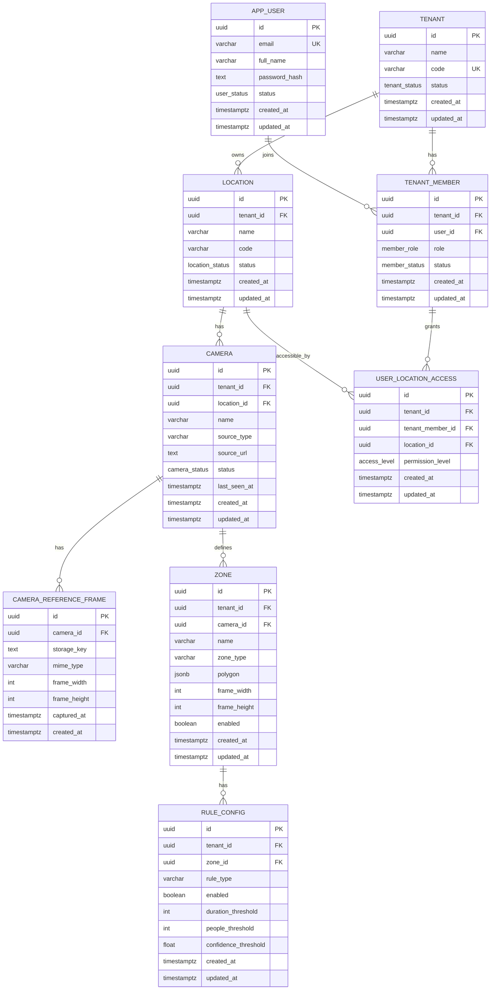

# PostgreSQL Base Database

Base database nay dung cho lop cau hinh he thong truoc khi tich hop AI event,
evidence, sensor va alert.

## Muc tieu

- Dung PostgreSQL native `uuid`.
- Moi bang nghiep vu co khoa chinh UUID.
- Tach du lieu theo `tenant`.
- Phan quyen user theo tung `location`.
- Luu camera, reference frame, zone va rule config.

## ERD



## Bang chinh

| Bang | Vai tro |
| --- | --- |
| `tenant` | To chuc/khach hang su dung he thong |
| `app_user` | Tai khoan dang nhap |
| `tenant_member` | User la thanh vien cua tenant nao va co role gi |
| `location` | Khu vuc vat ly cua tenant |
| `user_location_access` | Bang access: user trong tenant duoc phep thao tac location nao |
| `camera` | Camera/RTSP source thuoc location |
| `camera_reference_frame` | Metadata frame tinh de ve zone |
| `zone` | Polygon zone theo camera |
| `rule_config` | Rule cau hinh tren zone |

## Unique constraint quan trong

| Bang | Constraint |
| --- | --- |
| `tenant` | `UNIQUE(code)` |
| `app_user` | `UNIQUE(email)` |
| `tenant_member` | `UNIQUE(tenant_id, user_id)` |
| `location` | `UNIQUE(tenant_id, code)` |
| `user_location_access` | `UNIQUE(tenant_member_id, location_id)` |
| `camera` | `UNIQUE(location_id, name)`, `UNIQUE(tenant_id, source_url)` |
| `zone` | `UNIQUE(camera_id, name)` |
| `rule_config` | `UNIQUE(zone_id, rule_type)` |

## Tenant consistency

Nhung bang co `tenant_id` va lien ket xuong cap duoi dung composite foreign key
de tranh gan nham du lieu giua cac tenant.

Vi du:

```text
camera.tenant_id + camera.location_id
-> phai khop voi location.tenant_id + location.id
```

Tuong tu:

```text
user_location_access -> tenant_member cung tenant
user_location_access -> location cung tenant
zone -> camera cung tenant
rule_config -> zone cung tenant
```

## Chay PostgreSQL

Tu root repo:

```powershell
docker compose up -d postgres
```

Mac dinh:

```text
POSTGRES_DB=hitek_ai_iot
POSTGRES_USER=hitek_app
POSTGRES_PASSWORD=hitek_app_password
POSTGRES_PORT=5432
```

Co the override bang env:

```powershell
$env:POSTGRES_DB="hitek_ai_iot"
$env:POSTGRES_USER="hitek_app"
$env:POSTGRES_PASSWORD="change_me"
$env:POSTGRES_PORT="5432"
docker compose up -d postgres
```

## Kiem tra schema

```powershell
docker exec -it hitek-postgres psql -U hitek_app -d hitek_ai_iot
```

Trong `psql`:

```sql
\dt
\d tenant
\d user_location_access
SELECT id, name, code, status FROM tenant;
SELECT id, name, source_url FROM camera ORDER BY name;
```

Kiem tra user duoc xem camera nao:

```sql
SELECT
    au.email,
    tm.role,
    ula.permission_level,
    l.name AS location_name,
    c.name AS camera_name
FROM app_user au
JOIN tenant_member tm ON tm.user_id = au.id
JOIN user_location_access ula ON ula.tenant_member_id = tm.id
JOIN location l ON l.id = ula.location_id
JOIN camera c ON c.location_id = l.id
WHERE au.email = 'admin@demo.local'
ORDER BY l.name, c.name;
```

## Reset database dev

Init scripts chi chay khi volume PostgreSQL duoc tao lan dau. Neu muon reset sach:

```powershell
docker compose down
docker volume rm hitek-ai-iot_postgres-data
docker compose up -d postgres
```

Can than: lenh xoa volume se xoa toan bo du lieu PostgreSQL local.
