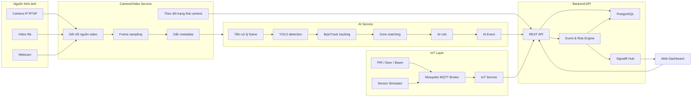
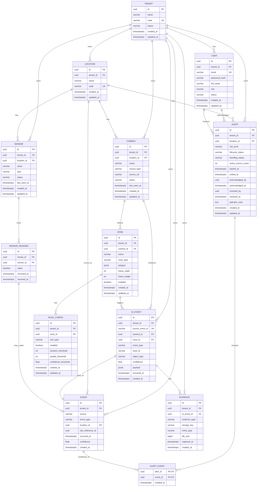

# Tài liệu kiến trúc và tích hợp hệ thống AI-IoT cảnh báo bất thường

Tài liệu này tổng hợp lại ý tưởng từ các báo cáo trong thư mục `reports` và tài liệu định hướng đề án. Mục tiêu là mô tả rõ hệ thống prototype AI-IoT, trách nhiệm của từng thành phần và cách kết nối các thành phần riêng lẻ thành một pipeline end-to-end có thể triển khai, kiểm thử và trình diễn.

## 1. Mục tiêu hệ thống

Hệ thống prototype AI-IoT có nhiệm vụ tiếp nhận dữ liệu từ camera và cảm biến, dùng AI để phát hiện tình huống bất thường, kết hợp nhiều nguồn dữ liệu để đánh giá mức rủi ro, sau đó tạo cảnh báo gần thời gian thực cho giao diện quản lý.

Chuỗi xử lý tổng quát:

```text
Camera / Video / Webcam
    -> Camera/Video Service
    -> AI Service
    -> Backend API
    -> Event & Risk Engine
    -> Alert
    -> Web Dashboard

Sensor / Simulator
    -> MQTT Broker hoặc HTTP
    -> IoT Service
    -> Backend API
    -> Event & Risk Engine
    -> Alert
    -> Web Dashboard
```

Các tình huống bất thường cần hỗ trợ trong prototype:

- Người xâm nhập vùng cấm.
- Người xuất hiện ngoài khung giờ quy định.
- Người đứng hoặc lưu lại quá lâu trong vùng hạn chế.
- Số lượng người trong vùng hạn chế vượt ngưỡng.
- Cảm biến cửa, PIR hoặc beam xác nhận bất thường cùng khu vực với camera.

## 2. Kiến trúc tổng thể



Nguyên tắc thiết kế chính:

- Camera/Video Service chỉ quản lý nguồn video, không chạy YOLO và không quyết định cảnh báo nghiệp vụ.
- AI Service chỉ phân tích hình ảnh và sinh AI Event, không tạo Official Alert trực tiếp.
- IoT Service là cầu nối mỏng giữa cảm biến và Backend API, không đọc ghi database và không chứa logic đánh giá rủi ro.
- Backend API là tầng duy nhất được đọc ghi trực tiếp database.
- Event & Risk Engine hợp nhất dữ liệu AI và IoT thông qua bảng Event chuẩn hóa, sau đó mới tạo Alert chính thức.
- Web Dashboard chỉ hiển thị dữ liệu đã được Backend chuẩn hóa và nhận cập nhật realtime qua SignalR.

## 3. Thành phần và trách nhiệm

| Thành phần | Đầu vào | Đầu ra | Trách nhiệm chính |
| --- | --- | --- | --- |
| Camera/Video Service | RTSP, video file, webcam | Frame + metadata, camera lifecycle event | Kết nối nguồn video, sampling FPS, reconnect, theo dõi ONLINE/OFFLINE/RECONNECTING |
| AI Service | Frame + metadata, zone config | Detection result, AI Event, evidence | YOLO detection, ByteTrack tracking, foot point, zone matching, rule xâm nhập/đứng lâu/tụ tập |
| IoT Service | MQTT topic, HTTP reading | Sensor reading chuẩn hóa gửi Backend | Nhận dữ liệu cảm biến, validate, chuẩn hóa thời gian/giá trị, theo dõi trạng thái cảm biến |
| Event & Risk Engine | Event từ AI và IoT | Alert tạo mới/cập nhật/đóng | Lọc nhiễu, hợp nhất theo khu vực và thời gian, tính risk, chống trùng cảnh báo |
| Backend API | Request từ service và dashboard | JSON API, SignalR event | Quản lý cấu hình, thiết bị, khu vực, lưu dữ liệu, xác thực, phân quyền, realtime |
| Web Dashboard | REST API, SignalR | Giao diện quản lý | Giám sát camera/cảm biến, xem cảnh báo, cập nhật trạng thái xử lý, tra cứu lịch sử |
| PostgreSQL | Dữ liệu từ Backend | Lưu trữ bền vững | Lưu sensor reading, event, alert, location, device, evidence metadata |
| Mosquitto | MQTT publish từ sensor | MQTT subscribe cho IoT Service | Broker trung gian cho dữ liệu cảm biến |

## 4. Quy ước chung giữa các module

Các nhóm cần thống nhất các quy ước sau trước khi tích hợp:

| Quy ước | Giá trị |
| --- | --- |
| REST prefix | `/api/v1` |
| Timestamp | ISO 8601, UTC, ví dụ `2026-07-30T09:15:22Z` |
| ID chính | UUID dạng chuỗi |
| JSON field | `snake_case` |
| Enum | `UPPER_SNAKE_CASE` |
| Error format | Có `error.code`, `message`, `details`, `request_id`, `timestamp` |
| Trace request | Header `X-Correlation-ID` |
| Realtime dashboard | SignalR tại `/hubs/alerts` |

Quy ước thời gian rất quan trọng vì Risk Engine phải so khớp sự kiện từ camera và cảm biến theo cùng một cửa sổ thời gian. Việc quy đổi sang giờ địa phương chỉ nên thực hiện ở giao diện hiển thị.

## 5. Luồng Camera/Video Service sang AI Service

Camera/Video Service nhận dữ liệu từ RTSP, webcam hoặc video file. Sau đó service lấy mẫu frame theo FPS cấu hình, resize hoặc encode frame sang JPEG, gắn metadata và gửi sang AI Service.

Endpoint khuyến nghị:

```http
POST /api/v1/ai/frames
Authorization: Bearer <service_token>
Content-Type: multipart/form-data
X-Correlation-ID: <uuid>
```

Request gồm hai phần:

| Multipart field | Kiểu | Ý nghĩa |
| --- | --- | --- |
| `metadata` | JSON | Thông tin camera, location, session, timestamp, sequence number, kích thước frame |
| `image` | JPEG/PNG binary | Dữ liệu ảnh của frame |

Metadata mẫu:

```json
{
  "frame_id": "cam01-0000018280",
  "camera_id": "550e8400-e29b-41d4-a716-446655440001",
  "location_id": "550e8400-e29b-41d4-a716-446655440002",
  "session_id": "550e8400-e29b-41d4-a716-446655440099",
  "source_type": "RTSP",
  "timestamp": "2026-07-30T09:15:22Z",
  "sequence_number": 18280,
  "source_width": 1920,
  "source_height": 1080,
  "frame_width": 1280,
  "frame_height": 720,
  "target_fps": 10,
  "encoding": "JPEG"
}
```

AI Service phản hồi:

```http
HTTP/1.1 202 Accepted
```

```json
{
  "frame_id": "cam01-0000018280",
  "camera_id": "550e8400-e29b-41d4-a716-446655440001",
  "session_id": "550e8400-e29b-41d4-a716-446655440099",
  "status": "ACCEPTED",
  "received_at": "2026-07-30T09:15:22.180Z",
  "correlation_id": "7908fa63-a43d-4d72-a75d-c87262bd2382"
}
```

### 5.1. Sampling, ordering và backpressure

Camera thực tế có thể chạy 25 hoặc 30 FPS, nhưng AI Service thường chỉ cần 5 đến 10 FPS cho prototype. Camera/Video Service cần chủ động sampling để giảm tải CPU/GPU và băng thông.

Các rule vận hành:

- Mỗi camera session có `sequence_number` tăng dần.
- AI Service xử lý frame trong cùng một `camera_id` và `session_id` theo đúng thứ tự.
- Nếu AI Service xử lý chậm, không để queue tăng vô hạn.
- Khi queue đầy, ưu tiên giữ frame mới hơn vì hệ thống cần gần thời gian thực.
- Drop frame phải có kiểm soát vì ByteTrack phụ thuộc vào chuỗi frame tương đối liên tục.

### 5.2. Camera lifecycle event

Camera/Video Service cần báo trạng thái camera về Backend API hoặc kênh event nội bộ.

Sự kiện mất kết nối:

```json
{
  "event_id": "550e8400-e29b-41d4-a716-446655440104",
  "event_source": "CAMERA_SERVICE",
  "event_type": "CAMERA_DISCONNECTED",
  "camera_id": "550e8400-e29b-41d4-a716-446655440001",
  "location_id": "550e8400-e29b-41d4-a716-446655440002",
  "session_id": "550e8400-e29b-41d4-a716-446655440099",
  "timestamp": "2026-07-30T09:20:00Z",
  "metadata": {
    "last_frame_at": "2026-07-30T09:19:45Z",
    "reason": "RTSP_READ_TIMEOUT",
    "retry_count": 3
  }
}
```

Sự kiện reconnect nên tạo `session_id` mới để AI Service reset tracking state, tránh dùng lại `track_id`, dwell time hoặc trạng thái zone từ phiên cũ.

## 6. AI Service

AI Service nhận frame và metadata từ Camera/Video Service, sau đó chạy pipeline xử lý ảnh số:

```text
Validate frame
    -> Preprocess
    -> YOLO detection
    -> Filter class
    -> ByteTrack tracking
    -> Foot point
    -> Zone matching
    -> Update tracking state
    -> Evaluate rule
    -> Create evidence
    -> Send AI Event
```

### 6.1. YOLO detection

YOLO dùng để phát hiện đối tượng trong frame. Với prototype, lớp bắt buộc cần xử lý là `PERSON`. Có thể mở rộng thêm `CAR`, `MOTORBIKE` nếu use case cần nhận diện phương tiện.

Detection tối thiểu cần có:

- `object_type`
- `confidence`
- `bbox`
- `camera_id`
- `location_id`
- `frame_id`
- `timestamp`

### 6.2. ByteTrack tracking

ByteTrack gán `track_id` cho đối tượng qua nhiều frame liên tiếp. `track_id` chỉ có ý nghĩa trong phạm vi một `camera_id` và một `session_id`, vì vậy mọi dữ liệu tracking gửi ra ngoài phải kèm hai trường này.

Tracking state dùng để tính:

- Thời gian đối tượng tồn tại trong zone.
- Khoảng cách di chuyển trong một cửa sổ thời gian.
- Số lượng người đang ở trong từng zone.
- Điều kiện chống gửi trùng AI Event.

### 6.3. Foot point

YOLO trả về bounding box, nhưng kiểm tra người nằm trong vùng nào nên dùng điểm chân thay vì tâm box.

```text
foot_point.x = (x1 + x2) / 2
foot_point.y = y2
```

Foot point phù hợp với camera giám sát góc cao vì nó đại diện tốt hơn cho vị trí đứng thực tế của người trên mặt sàn.

### 6.4. Zone configuration

Zone là polygon do người dùng hoặc quản trị viên cấu hình trên frame tham chiếu của camera. YOLO không tự phát hiện zone.

Hai loại zone chính:

| Zone | Ý nghĩa |
| --- | --- |
| `FORBIDDEN` | Vùng cấm, người không được phép xuất hiện |
| `RESTRICTED` | Vùng hạn chế, cho phép xuất hiện nhưng không được đứng lâu hoặc tụ tập |

Zone config mẫu:

```json
{
  "camera_id": "550e8400-e29b-41d4-a716-446655440001",
  "frame_width": 1280,
  "frame_height": 720,
  "zones": [
    {
      "zone_id": "550e8400-e29b-41d4-a716-446655440010",
      "name": "Vung cam cua kho",
      "zone_type": "FORBIDDEN",
      "points": [
        { "x": 100, "y": 200 },
        { "x": 500, "y": 200 },
        { "x": 520, "y": 600 },
        { "x": 80, "y": 600 }
      ],
      "rules": {
        "forbidden_min_duration_seconds": 1
      }
    },
    {
      "zone_id": "550e8400-e29b-41d4-a716-446655440011",
      "name": "Vung han che sanh cho",
      "zone_type": "RESTRICTED",
      "points": [
        { "x": 650, "y": 240 },
        { "x": 1150, "y": 240 },
        { "x": 1180, "y": 680 },
        { "x": 620, "y": 680 }
      ],
      "rules": {
        "loitering_duration_seconds": 10,
        "loitering_movement_threshold_pixels": 30,
        "crowding_min_people": 3,
        "crowding_duration_seconds": 5
      }
    }
  ],
  "updated_at": "2026-07-30T09:00:00Z"
}
```

### 6.5. AI Event

AI Event chỉ được sinh khi rule bất thường thỏa mãn. Không gửi event cho mọi detection bình thường.

Các event chính:

| Event type | Điều kiện |
| --- | --- |
| `FORBIDDEN_ZONE_INTRUSION` | Foot point của người nằm trong `FORBIDDEN` đủ thời gian tối thiểu |
| `RESTRICTED_ZONE_LONG_DWELL` | Người ở trong `RESTRICTED` quá lâu và di chuyển thấp hơn ngưỡng |
| `RESTRICTED_ZONE_CROWDING` | Số người trong `RESTRICTED` đạt ngưỡng và duy trì đủ lâu |

AI Event mẫu:

```json
{
  "event_id": "550e8400-e29b-41d4-a716-446655440101",
  "event_source": "AI",
  "event_type": "FORBIDDEN_ZONE_INTRUSION",
  "camera_id": "550e8400-e29b-41d4-a716-446655440001",
  "location_id": "550e8400-e29b-41d4-a716-446655440002",
  "session_id": "550e8400-e29b-41d4-a716-446655440099",
  "zone_id": "550e8400-e29b-41d4-a716-446655440010",
  "timestamp": "2026-07-30T09:15:22Z",
  "objects": [
    {
      "track_id": 12,
      "object_type": "PERSON",
      "confidence": 0.92,
      "bbox": { "x1": 120, "y1": 80, "x2": 260, "y2": 420 },
      "foot_point": { "x": 190, "y": 420 },
      "dwell_time_seconds": 2.4
    }
  ],
  "evidence": {
    "evidence_id": "550e8400-e29b-41d4-a716-446655440201",
    "image_url": "/api/v1/evidence/550e8400-e29b-41d4-a716-446655440201/image",
    "thumbnail_url": "/api/v1/evidence/550e8400-e29b-41d4-a716-446655440201/thumbnail"
  },
  "metadata": {
    "model_name": "yolo11n",
    "model_version": "pretrained-coco",
    "tracker": "bytetrack",
    "rule_name": "forbidden_zone_intrusion_v1"
  }
}
```

Trong prototype hiện tại, AI Event được gửi về Backend API qua REST. Endpoint triển khai theo báo cáo Backend là:

```http
POST /api/v1/events
```

Nếu dùng contract tổng quát trong `docs/API_CONTRACT_AND_CONVENTIONS.md`, endpoint tương đương có thể là:

```http
POST /api/v1/ai/events
```

Khi tích hợp thực tế cần chốt một đường dẫn duy nhất. Khuyến nghị dùng `/api/v1/events` nếu bám theo phần Backend đã triển khai, hoặc tạo alias `/api/v1/ai/events` để tương thích tài liệu contract cũ.

## 7. IoT Service và cảm biến

Ba loại cảm biến được chọn cho bài toán an ninh:

| Cảm biến | Tín hiệu | Ý nghĩa |
| --- | --- | --- |
| PIR | Boolean | Phát hiện chuyển động trong vùng rộng |
| Door/Contact | Boolean | Phát hiện cửa mở hoặc đóng tại điểm truy cập |
| Beam | Boolean | Phát hiện vật thể cắt ngang ranh giới |

Ba loại này bổ trợ nhau theo không gian: PIR bao quát vùng, Door kiểm soát điểm ra vào, Beam kiểm soát ranh giới. Trong prototype có thể dùng Sensor Simulator để publish dữ liệu giống thiết bị thật.

### 7.1. MQTT

MQTT là kênh chính cho dữ liệu IoT vì nhẹ, phù hợp publish/subscribe và duy trì kết nối lâu dài. HTTP được giữ làm đường dự phòng cho kiểm thử bằng Postman hoặc curl.

Topic theo báo cáo Backend:

```text
hitek/<sensorId>/reading
```

IoT Service subscribe:

```text
hitek/+/reading
```

Trong contract tổng quát có biến thể versioned:

```text
hitek/v1/devices/{device_id}/readings
```

Khi code tích hợp, nên chuẩn hóa về một convention. Nếu hệ thống hiện tại đã dùng `hitek/<sensorId>/reading`, tiếp tục dùng convention này cho prototype để giảm thay đổi.

Payload cảm biến:

```json
{
  "value": true,
  "recordedAt": "2026-08-25T09:15:22Z"
}
```

Quy tắc truyền tin:

- Dùng QoS 1 để giảm nguy cơ mất tín hiệu.
- Chấp nhận khả năng trùng bản ghi do QoS 1 có thể gửi lại.
- Cần cấu hình QoS nhất quán ở cả phía publish và subscribe, vì mức thực tế là mức thấp hơn giữa hai bên.

### 7.2. Chuẩn hóa dữ liệu cảm biến

IoT Service xử lý mọi dữ liệu đầu vào qua bốn bước:

1. Kiểm tra cảm biến có tồn tại trong hệ thống.
2. Chuẩn hóa thời gian về ISO 8601 UTC.
3. Chuẩn hóa giá trị về boolean.
4. Bổ sung `received_at` để đo độ trễ giữa thời điểm cảm biến ghi nhận và thời điểm server nhận được.

Sau khi chuẩn hóa, IoT Service gọi Backend:

```http
POST /api/v1/iot/readings
Content-Type: application/json
Authorization: Bearer <service_token>
```

Payload nội bộ khuyến nghị:

```json
{
  "sensor_id": "pir-warehouse-01",
  "value": true,
  "recorded_at": "2026-08-25T09:15:22Z",
  "received_at": "2026-08-25T09:15:22.120Z",
  "source": "MQTT"
}
```

### 7.3. Theo dõi trạng thái thiết bị

Mỗi tin nhắn hợp lệ, dù `value` là `true` hay `false`, đều chứng minh cảm biến còn hoạt động. Backend hoặc IoT Service cập nhật:

- `last_seen_at`
- `status = ONLINE`

Một tiến trình nền quét định kỳ danh sách cảm biến. Nếu `now - last_seen_at` vượt ngưỡng cấu hình thì đánh dấu:

```text
status = OFFLINE
```

Khi cảm biến gửi dữ liệu lại, trạng thái tự chuyển về `ONLINE`.

## 8. Backend API

Backend API là tầng dữ liệu và giao tiếp chung của hệ thống. Đây là thành phần duy nhất đọc ghi trực tiếp PostgreSQL.

Trách nhiệm:

- Quản lý Location, Camera, Zone, Sensor, Alert, Evidence, User.
- Tiếp nhận sensor reading từ IoT Service.
- Tiếp nhận AI Event từ AI Service.
- Lưu dữ liệu thô và dữ liệu đã chuẩn hóa.
- Gọi Event & Risk Engine sau khi lưu dữ liệu mới.
- Cung cấp API cho Web Dashboard.
- Đẩy realtime alert qua SignalR.
- Xử lý xác thực và phân quyền.

Endpoint chính theo báo cáo Backend:

| Method | Path | Bên gọi | Mục đích |
| --- | --- | --- | --- |
| `GET` | `/api/v1/areas` | AI Service, Frontend | Lấy danh sách khu vực hợp lệ |
| `GET` | `/api/v1/sensors` | Frontend | Danh sách cảm biến kèm trạng thái |
| `POST` | `/api/v1/sensors` | Frontend | Đăng ký cảm biến mới |
| `POST` | `/api/v1/iot/readings` | IoT Service | Ghi nhận lượt đọc cảm biến |
| `POST` | `/api/v1/events` | AI Service | Ghi nhận sự kiện AI |
| `GET` | `/api/v1/alerts` | Frontend | Tra cứu cảnh báo |
| `PATCH` | `/api/v1/alerts/{id}` | Frontend | Cập nhật trạng thái xử lý |
| `WebSocket` | `/hubs/alerts` | Frontend | Nhận cảnh báo realtime |

Endpoint `/api/v1/areas` hoặc `/api/v1/locations` cần được coi là contract tích hợp quan trọng. AI Service và IoT/Sensor config phải dùng cùng `location_id`; nếu mỗi nhóm tự đặt mã khu vực khác nhau, Risk Engine sẽ không thể cộng dồn tín hiệu cho cùng một vị trí vật lý.

## 9. Mô hình dữ liệu tối thiểu


Các bảng chính:

| Bảng | Ý nghĩa |
| --- | --- |
| `TENANT` | Đơn vị sở hữu dữ liệu, ví dụ một khách hàng, tổ chức hoặc site |
| `USER` | Tài khoản người dùng thuộc một `TENANT`, dùng để đăng nhập, phân quyền và xử lý alert |
| `LOCATION` | Khu vực vật lý thuộc tenant, dùng chung cho camera, cảm biến, event và alert |
| `CAMERA` | Nguồn camera/RTSP/video thuộc tenant và gắn với một location |
| `ZONE` | Vùng hình học trên từng camera, ví dụ vùng cấm hoặc vùng hạn chế |
| `RULE_CONFIG` | Cấu hình rule áp dụng cho từng zone |
| `AI_EVENT` | Sự kiện gốc từ AI Service trước khi chuẩn hóa thành `EVENT` |
| `SENSOR` | Danh sách cảm biến, loại cảm biến, trạng thái online/offline |
| `SENSOR_READING` | Dữ liệu thô đầy đủ từ cảm biến |
| `EVENT` | Sự kiện chuẩn hóa từ AI hoặc IoT, đầu vào cho Risk Engine |
| `ALERT` | Cảnh báo chính thức hiển thị cho người vận hành |
| `ALERT_EVENT` | Bảng nối giúp truy vết event nào đã đóng góp vào alert nào |
| `EVIDENCE` | Metadata ảnh/video bằng chứng của `AI_EVENT`; file thật nằm ở object storage |

Quy tắc lưu dữ liệu:

- Không lưu toàn bộ frame hoặc video vào database.
- Chỉ lưu metadata, event, alert và đường dẫn evidence.
- Ảnh bằng chứng nên lưu ở filesystem hoặc object storage, database chỉ lưu metadata và URL.
- Sensor reading âm vẫn lưu ở `SensorReading` để truy vết, nhưng chỉ tạo `Event` khi tín hiệu dương.
- Mọi bảng dữ liệu nghiệp vụ chính cần có `tenant_id` để tránh lẫn dữ liệu giữa các user/tổ chức.
- User đăng nhập sẽ lấy `tenant_id`, sau đó hệ thống lấy danh sách camera theo `CAMERA.tenant_id`.

## 10. Event & Risk Engine

Trong prototype, Event & Risk Engine được triển khai bên trong Backend API và được gọi ngay sau khi Backend lưu sensor reading hoặc AI Event. Cách này đủ đơn giản cho quy mô hiện tại và tránh phải vận hành thêm queue hoặc worker riêng.

### 10.1. Chuẩn hóa event

AI Event và IoT Reading có cấu trúc khác nhau, nên Backend đưa chúng về bảng `Event` chung trước khi tính risk.

Event chuẩn hóa tối thiểu:

```json
{
  "event_id": "550e8400-e29b-41d4-a716-446655440301",
  "source": "AI",
  "event_type": "FORBIDDEN_ZONE_INTRUSION",
  "location_id": "550e8400-e29b-41d4-a716-446655440002",
  "timestamp": "2026-07-30T09:15:22Z",
  "confidence": 0.92,
  "raw_reference_id": "550e8400-e29b-41d4-a716-446655440101"
}
```

Với IoT, `confidence` có thể để trống vì cảm biến vật lý không có khái niệm độ tin cậy như mô hình AI.

### 10.2. Lọc nhiễu

Hai nguồn dữ liệu có đặc tính khác nhau nên dùng hai cơ chế lọc nhiễu riêng:

| Nguồn | Cơ chế | Ví dụ cấu hình |
| --- | --- | --- |
| IoT | Cửa sổ trượt theo số lượt đọc gần nhất | Cảm biến được coi là active khi 3 reading gần nhất đều dương |
| AI | Cửa sổ thời gian + confidence threshold | AI active nếu có event trong vài giây gần nhất và `confidence >= threshold` |

Lý do không dùng cùng một cơ chế cho AI và IoT: AI có thể gửi event theo từng frame với tần suất cao, nếu đếm số lần liên tiếp như cảm biến thì ngưỡng sẽ đạt gần như tức thì và mất tác dụng lọc nhiễu.

### 10.3. Hợp nhất theo khu vực và thời gian

Hai tín hiệu chỉ được xem là cùng mô tả một sự việc khi:

- Cùng `location_id`.
- Nằm trong cửa sổ thời gian cấu hình.
- Đến từ các nguồn độc lập, ví dụ AI, PIR, Door, Beam.

Cửa sổ quá hẹp có thể tách một sự việc thật thành nhiều sự việc rời rạc. Cửa sổ quá rộng có thể gộp các sự việc không liên quan. Với prototype, nên bắt đầu ở mức vài giây và hiệu chỉnh bằng test case.

### 10.4. Tính mức rủi ro

Mức rủi ro dựa trên số nguồn độc lập đang xác nhận bất thường trong cùng khu vực:

| Số nguồn active | Risk level | Diễn giải |
| --- | --- | --- |
| 0 | `LOW` | Không có dấu hiệu bất thường |
| 1 | `MEDIUM` | Có tín hiệu đơn lẻ, cần theo dõi |
| 2 | `HIGH` | Hai nguồn độc lập cùng xác nhận |
| Từ 3 trở lên | `CRITICAL` | Nhiều nguồn xác nhận, khả năng cao là sự việc thật |

Quy tắc theo khung giờ:

- Nếu có từ hai nguồn trở lên cùng xác nhận ngoài giờ làm việc, đẩy thẳng lên `CRITICAL`.
- Khung giờ làm việc nên lưu theo UTC trong cấu hình.
- Frontend chịu trách nhiệm hiển thị theo giờ địa phương.

### 10.5. Vòng đời cảnh báo

Alert không phải bản ghi tĩnh mà có vòng đời:

```text
NEW / OPEN
    -> risk tăng hoặc giảm
    -> ACKNOWLEDGED
    -> RESOLVED / CLOSED
```

Risk Engine vận hành như sau:

1. Tính lại số nguồn active trong `location_id`.
2. Kiểm tra location đó có alert đang mở hay không.
3. Nếu có nguồn active và chưa có alert mở, tạo alert mới.
4. Nếu đã có alert mở và risk thay đổi, cập nhật chính alert đó.
5. Nếu không còn nguồn active, chờ một khoảng `close_grace_period_seconds`.
6. Chỉ đóng alert khi trong toàn bộ khoảng chờ không có tín hiệu dương mới.

Lý do cập nhật cùng một alert thay vì tạo nhiều alert: một người đi vào và đi ra khỏi khu vực là một sự việc duy nhất, dù mức rủi ro có thay đổi trong quá trình đó.

### 10.6. Chống trùng

Ở prototype, nguyên tắc chống trùng là mỗi khu vực chỉ có tối đa một alert đang mở tại một thời điểm.

Cần bổ sung trong giai đoạn hoàn thiện:

- `dedup_key` cho AI Event.
- `event_id` duy nhất từ phía AI Service và IoT Service.
- Unique constraint ở database nếu Risk Engine chạy nhiều instance.
- Idempotency khi service retry do timeout.

## 11. Web Dashboard

Dashboard dùng REST API để lấy dữ liệu ban đầu và SignalR để nhận cập nhật realtime.

Chức năng tối thiểu:

- Xem số camera, cảm biến và trạng thái kết nối.
- Xem danh sách cảnh báo mới nhất.
- Lọc cảnh báo theo thời gian, mức risk, trạng thái xử lý.
- Xem evidence image hoặc thumbnail.
- Cập nhật trạng thái xử lý và ghi chú của người vận hành.
- Xem danh sách cảm biến, `last_seen_at`, ONLINE/OFFLINE.
- Xem danh sách khu vực giám sát và zone cấu hình.

Luồng realtime:

```text
Risk Engine tạo/cập nhật/đóng Alert
    -> Backend lưu DB
    -> Backend phát SignalR message qua /hubs/alerts
    -> Dashboard cập nhật danh sách cảnh báo
```

SignalR chỉ nên phát khi alert được tạo mới, đổi mức hoặc đóng lại. Không phát ở mọi sensor reading hoặc mọi frame để tránh làm dashboard quá tải.

## 12. Luồng end-to-end mẫu

### 12.1. Xâm nhập vùng cấm có cảm biến cửa

```text
1. Door sensor gửi MQTT reading value = true.
2. IoT Service nhận topic hitek/<sensorId>/reading.
3. IoT Service validate và gọi POST /api/v1/iot/readings.
4. Backend lưu SensorReading và tạo IoT Event nếu value dương.
5. Camera/Video Service gửi frame sang AI Service.
6. AI Service chạy YOLO, phát hiện PERSON.
7. ByteTrack gán track_id.
8. AI Service tính foot_point nằm trong FORBIDDEN zone.
9. AI Service tạo FORBIDDEN_ZONE_INTRUSION event.
10. AI Service gọi POST /api/v1/events.
11. Backend lưu Event và gọi Risk Engine.
12. Risk Engine thấy Door + AI cùng location trong cửa sổ thời gian.
13. Risk Engine tính risk = HIGH hoặc CRITICAL nếu ngoài giờ.
14. Backend tạo hoặc cập nhật Alert.
15. Backend phát SignalR message tới Dashboard.
16. Người vận hành xem evidence và cập nhật trạng thái xử lý.
```

### 12.2. Người đứng lâu trong vùng hạn chế

```text
1. Camera/Video Service gửi frame đều theo target_fps.
2. AI Service phát hiện PERSON và tracking cùng track_id.
3. Foot point liên tục nằm trong RESTRICTED zone.
4. Dwell time vượt loitering_duration_seconds.
5. Movement trong cửa sổ thời gian thấp hơn ngưỡng.
6. AI Service tạo RESTRICTED_ZONE_LONG_DWELL event.
7. Backend lưu Event và Risk Engine tính risk.
8. Nếu chỉ có AI xác nhận, risk = MEDIUM.
9. Nếu PIR hoặc Beam cùng khu vực cũng active, risk tăng lên HIGH hoặc CRITICAL.
```

### 12.3. Tụ tập đông người

```text
1. AI Service phát hiện nhiều PERSON trong cùng RESTRICTED zone.
2. Số người >= crowding_min_people.
3. Trạng thái này duy trì >= crowding_duration_seconds.
4. AI Service tạo RESTRICTED_ZONE_CROWDING event.
5. Risk Engine kết hợp thêm IoT nếu có.
6. Backend tạo Alert và phát realtime.
```

## 13. Hạ tầng triển khai prototype

Stack khuyến nghị:

| Hạng mục | Công nghệ |
| --- | --- |
| AI/Computer Vision | Python, PyTorch, Ultralytics YOLO, OpenCV, ByteTrack |
| Backend | .NET 8 Web API |
| IoT Worker | .NET 8 Worker Service hoặc Python worker |
| Database | PostgreSQL |
| MQTT Broker | Eclipse Mosquitto |
| Realtime | SignalR |
| Frontend | React, Vue, Blazor hoặc framework nhóm chọn |
| Đóng gói | Docker Compose |

Container tối thiểu:

```text
postgres
mosquitto
backend-api
iot-service
ai-service
camera-video-service
web-dashboard
sensor-simulator
```

Ở prototype hiện tại, báo cáo Backend mô tả solution .NET 8 gồm:

- `Hitek.BackendApi`: Web API, database model, endpoint, SignalR và Risk Engine.
- `Hitek.IotService`: Worker Service kết nối MQTT và chuyển tiếp dữ liệu sang Backend.
- `Hitek.SensorSimulator`: Console app giả lập ba cảm biến.

Repo hiện tại cũng có notebook thử nghiệm YOLO tại `code/test/test_YOLO.ipynb` và model `code/test/yolo11n.pt`, phù hợp để kiểm tra nhanh detection trên ảnh hoặc video mẫu.

## 14. Cấu hình quan trọng

Các tham số nên đưa vào file cấu hình thay vì viết cứng:

| Tham số | Ý nghĩa |
| --- | --- |
| `target_fps` | FPS gửi từ Camera/Video Service sang AI |
| `frame_width`, `frame_height` | Kích thước frame đưa vào AI |
| `ai_confidence_threshold` | Ngưỡng confidence tối thiểu của AI Event |
| `iot_positive_window_count` | Số reading dương liên tiếp để cảm biến active |
| `ai_event_window_seconds` | Cửa sổ thời gian xem AI còn active |
| `risk_fusion_window_seconds` | Cửa sổ hợp nhất AI và IoT |
| `close_grace_period_seconds` | Thời gian chờ trước khi đóng alert |
| `working_hours_utc` | Khung giờ làm việc hợp lệ |
| `dedup_window_seconds` | Khoảng chống gửi trùng event hoặc alert |
| `sensor_offline_timeout_seconds` | Ngưỡng đánh dấu cảm biến offline |
| `camera_reconnect_retry_count` | Số lần thử reconnect camera |
| `camera_reconnect_interval_seconds` | Khoảng cách giữa các lần reconnect |

## 15. Checklist tích hợp giữa các nhóm

### 15.1. Nhóm Camera/AI

- Đọc được RTSP, webcam hoặc video file.
- Gửi frame sang `/api/v1/ai/frames` hoặc để AI Service tự đọc source theo phương án prototype.
- Metadata có đủ `camera_id`, `location_id`, `session_id`, `timestamp`, `sequence_number`.
- YOLO detect được `PERSON`.
- ByteTrack duy trì `track_id` ổn định trong kịch bản thử nghiệm.
- Tính đúng foot point.
- Kiểm tra foot point trong polygon zone.
- Sinh đủ các AI Event đã thống nhất.
- Tạo evidence image khi có event.
- Gửi event sang Backend qua `/api/v1/events` hoặc endpoint đã chốt.

### 15.2. Nhóm IoT

- Sensor Simulator publish MQTT đúng topic.
- IoT Service subscribe topic wildcard.
- QoS publish và subscribe thống nhất ở mức 1.
- Validate được sensor id, value và timestamp.
- Chuẩn hóa value về boolean.
- Gọi Backend qua `/api/v1/iot/readings`.
- Cập nhật trạng thái ONLINE/OFFLINE.
- Ghi log khi Backend lỗi hoặc MQTT reconnect.

### 15.3. Nhóm Backend/Risk

- Có endpoint lấy danh sách khu vực chuẩn cho AI và Dashboard.
- Lưu Sensor, SensorReading, Event, Alert.
- Chỉ tạo Event từ sensor khi reading dương.
- Gọi Risk Engine sau khi lưu AI Event hoặc SensorReading.
- Lọc nhiễu riêng cho AI và IoT.
- Tính risk theo số nguồn active.
- Có rule ngoài giờ làm việc.
- Chống trùng alert đang mở theo location.
- Đóng alert sau grace period.
- Phát SignalR khi alert tạo mới, đổi mức hoặc đóng.

### 15.4. Nhóm Frontend

- Hiển thị dashboard tổng quan.
- Kết nối SignalR `/hubs/alerts`.
- Gọi `GET /api/v1/alerts` để lấy dữ liệu ban đầu.
- Cập nhật trạng thái alert bằng `PATCH /api/v1/alerts/{id}`.
- Hiển thị evidence image hoặc thumbnail.
- Hiển thị trạng thái camera và sensor.
- Có bộ lọc theo thời gian, risk level và status.

## 16. Test case nghiệm thu prototype

| STT | Test case | Kết quả mong đợi |
| --- | --- | --- |
| 1 | Người đi vào vùng cấm trong giờ làm việc, chỉ AI phát hiện | Tạo alert `MEDIUM` |
| 2 | Người đi vào vùng cấm, AI và Door cùng xác nhận | Tạo hoặc nâng alert lên `HIGH` |
| 3 | Người đi vào vùng cấm ngoài giờ, AI và Beam cùng xác nhận | Alert `CRITICAL` |
| 4 | PIR nhiễu một lần rồi tắt | Không tạo alert nếu chưa đạt cửa sổ trượt |
| 5 | AI detect nhầm một frame confidence thấp | Không tạo active source nếu dưới ngưỡng |
| 6 | Người đứng lâu trong restricted zone | Tạo event long dwell và alert tương ứng |
| 7 | Ba người tụ tập trong restricted zone đủ thời gian | Tạo event crowding |
| 8 | Camera mất RTSP rồi reconnect | Dashboard thấy trạng thái camera thay đổi, session mới được tạo |
| 9 | Sensor ngừng gửi dữ liệu quá timeout | Sensor chuyển OFFLINE |
| 10 | Một sự việc kéo dài nhiều phút | Chỉ có một alert mở cho cùng location, risk được cập nhật trên alert đó |
| 11 | Tín hiệu mất ngắn rồi quay lại | Alert không bị đóng mở liên tục nhờ grace period |
| 12 | Dashboard reload trang | Lấy lại alert qua REST và tiếp tục nhận SignalR |

## 17. Rủi ro và hướng hoàn thiện

Các điểm còn cần xử lý trước khi tiến gần sản xuất:

- Chốt một contract duy nhất cho AI Event: `/api/v1/events` hoặc `/api/v1/ai/events`.
- Bổ sung `event_id` hoặc `dedup_key` để idempotent khi AI, IoT hoặc MQTT gửi lại.
- Bổ sung hoặc hoàn thiện bảng `EVIDENCE` và quy ước lưu ảnh/clip bằng chứng.
- Bổ sung xác thực riêng cho user và service nội bộ.
- Đưa `RULE_CONFIG` vào luồng quản trị nếu cần cho phép chỉnh rule trên dashboard.
- Thêm bounded queue, retry có kiểm soát và backpressure cho Camera/Video Service, AI Service và IoT Service.
- Bổ sung unique constraint chống nhiều instance Risk Engine tạo trùng alert.
- Chuẩn hóa topic MQTT và QoS giữa simulator, thiết bị và IoT Service.
- Đo end-to-end latency từ `recorded_at` hoặc frame `timestamp` đến lúc dashboard nhận SignalR.
- Kiểm thử precision/recall/F1 của YOLO trên dữ liệu thực tế của bối cảnh triển khai.

## 18. Kết luận

Kiến trúc phù hợp cho prototype là tách hệ thống thành các service có trách nhiệm rõ ràng: Camera/Video Service ổn định luồng hình ảnh, AI Service phát hiện bất thường bằng YOLO và ByteTrack, IoT Service chuẩn hóa tín hiệu cảm biến, Backend API quản lý dữ liệu, Event & Risk Engine hợp nhất sự kiện và Web Dashboard hiển thị cảnh báo realtime.

Điểm nối quan trọng nhất giữa các nhóm là `location_id`, timestamp UTC và Event contract. Khi các thành phần cùng dùng chung khu vực, thời gian và định dạng event, hệ thống có thể hợp nhất tín hiệu từ camera và cảm biến để giảm báo động giả, nâng mức cảnh báo theo bằng chứng đa nguồn và tạo một luồng giám sát end-to-end rõ ràng.
